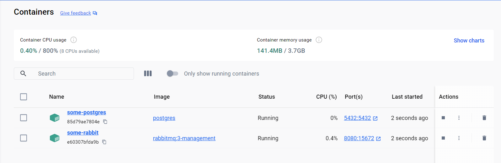



Postgresql kurulumu:

- Komut isteminden aşağıdaki komutu çalıştırdım:

docker run --name some-postgres -p 5432:5432 -e POSTGRES\_PASSWORD=mysecretpassword -d postgres

Rabbitmq kurulumu:

- Komut isteminden aşağıdaki komutu çalıştırdım:

docker run -d --hostname my-rabbit --name some-rabbit -p 8080:15672 rabbitmq:3-management

